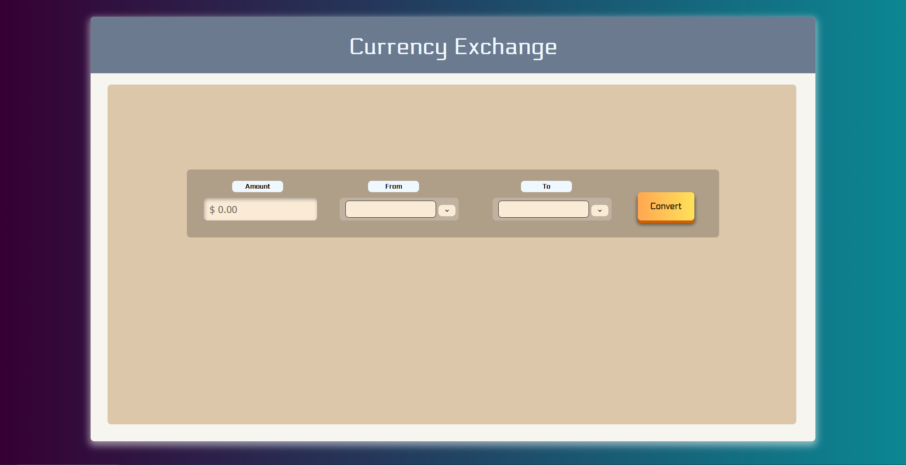

# Getting Started
Run the app on your local server(localhost).

**User will need to provide their own API key from.** https://www.exchangerate-api.com/

# Files

* index.html : This file contains the HTML code for the app.
* style.css : This file contains the CSS code for the app.
* script.js : This file contains the JavaScript code for the apps functionality.
* server.js : This file contains the code for caching responses and all the API GET's. 
* images Folder : This folder contains the images which are used in the README and icon.

API used from: https://www.exchangerate-api.com/